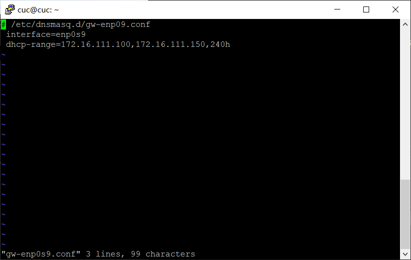
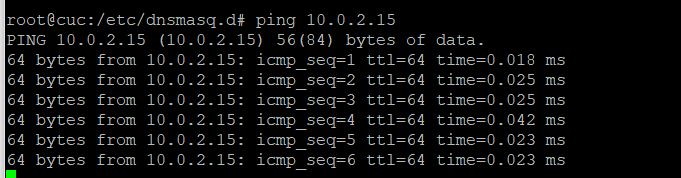

# 基于 VirtualBox 的网络攻防基础环境搭建

## 实验目的
- [x] 掌握 VirtualBox 虚拟机的安装与使用
- [x] 掌握 VirtualBox 的虚拟网络类型和按需配置
- [x] 掌握 VirtualBox 的虚拟硬盘多重加载

## 实验环境
- VirtualBox 虚拟机
- 攻击者主机（Attacker）：Kali Rolling 2109.2
- 网关（Gateway, GW）：Debian Buster
- 靶机（Victim）： xp-sp3 / Kali

## 实验要求

- [x] 虚拟硬盘配置成多重加载

- [x] 搭建满足如下拓扑图所示的虚拟机网络拓扑

- [x] 完成以下网络连通性测试

  - 靶机可以直接访问攻击者主机

  - 攻击者主机无法直接访问靶机

  - 网关可以直接访问攻击者主机和靶机

  - 靶机的所有对外上下行流量必须经过网关

  - 所有节点均可以访问互联网


## 实验过程

- 安装所需虚拟光盘
    

- 利用虚拟镜像安装系统设置多重加载，并使用多重加载创建实验所需虚拟机
    
    

- 根据实验要求配置虚拟机网络设置
    

- 使用debian查看ip发现错误，经过修改网络配置文件以达到实验需求
    
    
    

- 使用iptables查看修改是否生效
    

- 修改enp0s9，enp0s10，主网络配置文件以达到实验需求
    
    
    

- kali内部网络intnet1，intnet2 ip自动获取
    
    

- xp内部网络ip自动获取
    

- kali攻击者net网络自动分配
    

## 遇到的问题与解决
- 安装的镜像无法正常加载
    - 解决：选择老师推荐的镜像进行安装

- 在kali环境下使用`ifconfig`提示`command not found`
    - 解决：加入/sbin到系统环境变量
  ```cmd
  export PATH=$PATH:/sbin
  ```
- windows-xp与网关无法联通
    - 解决：关闭xp系统防火墙


## 连通性检测

- 靶机可以直接访问攻击者主机
    
    

- 攻击者主机无法直接访问靶机
        

- 网关可以直接访问攻击者主机和靶机
     
    
     

- 所有节点均可以访问互联网 
     
    
      
     

- 靶机的所有对外上下行流量必须经过网关
     
    
      

## 参考文献
- [第一章 网络安全基础](https://www.bilibili.com/video/BV16t4y1i7rz)
- [安装Windows XP教程](https://blog.csdn.net/q1302182594/article/details/8720545)
- [课本在线文档](https://c4pr1c3.github.io/cuc-ns/chap0x01/exp.html)