## 基于 Scapy 编写端口扫描器  

### 实验目的  

* 掌握网络扫描之端口状态探测的基本原理  

### 实验环境  
* python + scapy 2.4.3  
* nmap  

### 网络拓扑结构  
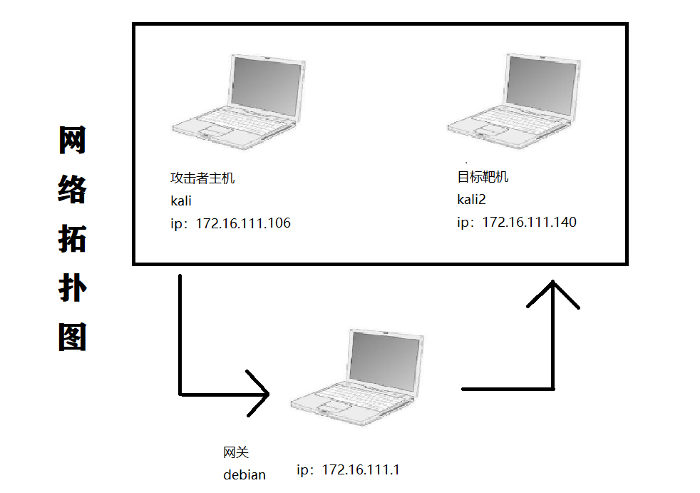  
|身份|虚拟机名称|网卡|IP地址|
|--|--|--|--|
|网关|DEBIAN-1|intnet1|172.16.111.1|
|攻击者主机|KALI-attack|intnet1|172.16.111.106|
|目标靶机|KKK|intnet1|172.16.111.140|  

### 实验要求  
- [x] 完成以下扫描技术的编程实现  
  * TCP connect scan / TCP stealth scan  
  * TCP Xmas scan / TCP fin scan / TCP null scan  
  * UDP scan  
- [x] 上述每种扫描技术的实现测试均需要测试端口状态为：`开放`、`关闭`和`过滤`状态时的程序执行结果  
- [x] 提供每一次扫描测试的抓包结果并分析与课本中的扫描方法原理是否相符？如果不同，试分析原因  
- [x] 在实验报告中详细说明实验网络环境拓扑、被测试 IP 的端口状态是如何模拟的  
- [x] （可选）复刻`nmap`的上述扫描技术实现的命令行参数开关


### 实验过程

#### TCP connect scan

* 实验预期获得的结果：倘若攻击者向靶机发送SYN包，能完成三次握手，收到[SYN/ACK]包,则端口为开发状态；若只收[RST,ACK]包，则端口为关闭状态；倘若什么都没收到，即为端口过滤状态。

* scapy编程python代码实现
  ```
  from scapy.all import *
  def tcpconnect(dst_ip,dst_port,timeout=10):
      pkts=sr1(IP(dst=dst_ip)/TCP(dport=dst_port,flags="S"),timeout=timeout)
      if (pkts is None):
          print("FILTER")
      elif(pkts.haslayer(TCP)):
          if(pkts[1].flags=='AS'):
              print("OPEN")
          elif(pkts[1].flags=='AR'):
                  print("CLOSE")
  tcpconnect('172.16.111.140',80)
  ```  
* closed
    初始状态下，端口状态未关闭
    攻击者主机运行python脚本  
    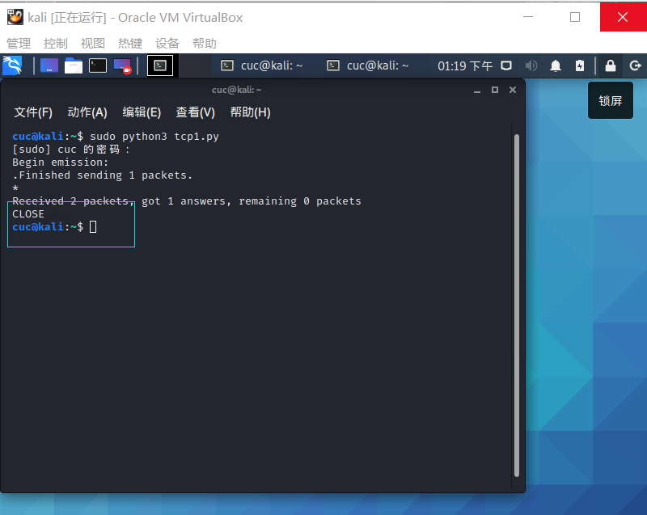  
    靶机Wireshark抓包  
    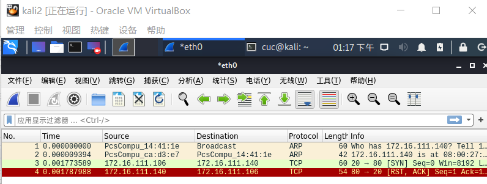  
    攻击者主机`nmap`复刻  `sudo nmap -sT -p 80 172.16.111.140` 
    - 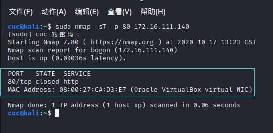 
 - 分析：TCP三次握手机制，攻击者主机向靶机发送连接请求后，靶机相应端口处于关闭状态，靶机将会向攻击者返回[RST,ACK]包，抓包结果与预期结果一致。  
  
* Open  
    靶机开放80端口  
    `systemctl start apache2` 开启apache2服务从而开放80端口  
    攻击者主机运行python脚本  
    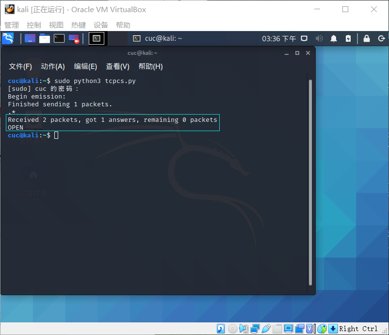  
    靶机Wireshark抓包  
    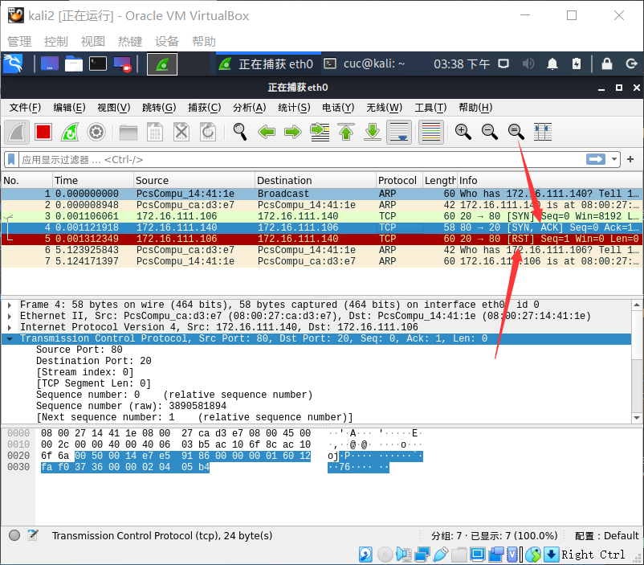 
    攻击者主机`nmap`复刻  `sudo nmap -sT -p 80 172.16.111.140` 
    - 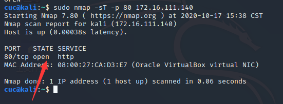  
 - 分析：TCP三次握手机制，攻击者主机向靶机发送连接请求后，收到靶机返回[SYN/ACK]数据包，抓包结果与预期结果一致。  

* Filtered  
    靶机添加规则过滤80端口  
    `iptables -A INPUT -p tcp --dport 80 -j DROP`   
    攻击者主机运行python脚本  
    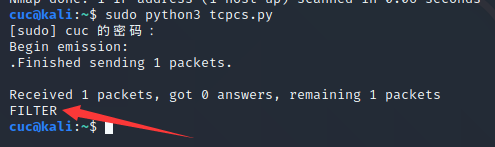  
    靶机Wireshark抓包  
    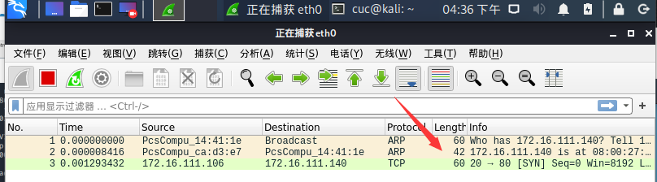 
    攻击者主机`nmap`复刻 `sudo nmap -sT -p 80 172.16.111.140` 
    - 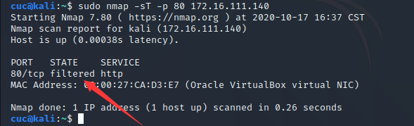    
 - 分析：TCP三次握手机制，攻击者主机向靶机发送连接请求后，没有得到任何响应，抓包结果与预期结果一致。  


#### TCP stealth scan

* 与TCP connect scan扫描非常相似，因此此处实验简化一些步骤

* python
  ```
  from scapy.all import *
  def tcpstealthscan(dst_ip , dst_port , timeout = 10):
      pkts = sr1(IP(dst=dst_ip)/TCP(dport=dst_port,flags="S"),timeout=10)
      if (pkts is None):
          print ("Filtered")
      elif(pkts.haslayer(TCP)):
          if(pkts.getlayer(TCP).flags == 0x12):
              send_rst = sr(IP(dst=dst_ip)/TCP(dport=dst_port,flags="R"),timeout=10)
              print ("Open")
          elif (pkts.getlayer(TCP).flags == 0x14):
              print ("Closed")
          elif(pkts.haslayer(ICMP)):
              if(int(pkts.getlayer(ICMP).type)==3 and int(stealth_scan_resp.getlayer(ICMP).code) in [1,2,3,9,10,13]):
                  print ("Filtered")
  tcpstealthscan('172.16.111.140',80)
  ```  

* Closed  
    `systemctl stop apache2` 关闭apache2服务
    ` iptables -t nat -F `清除防火墙规则
    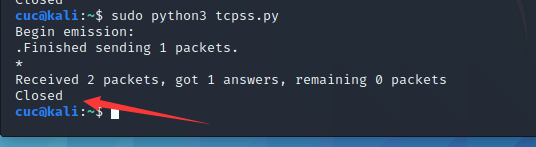 
    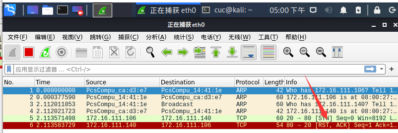 
    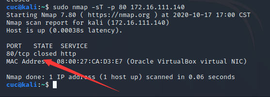 

* Open  
    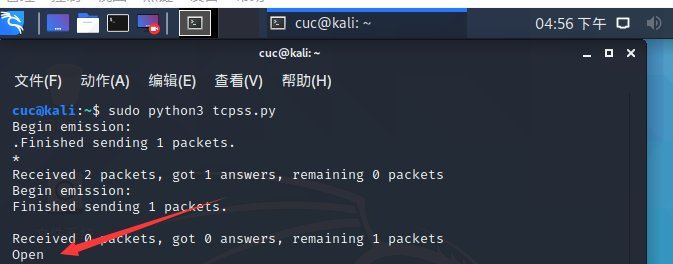 
    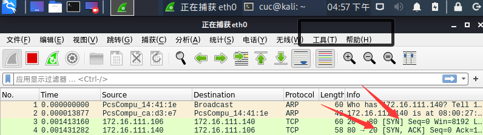 
    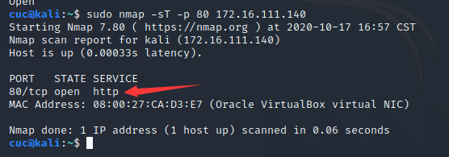 

* Filtered  
    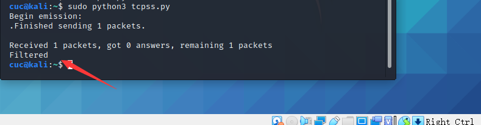
    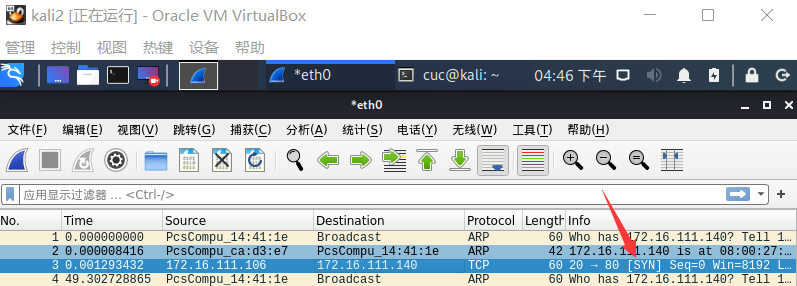
    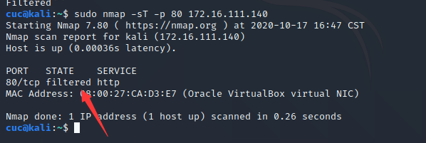


#### TCP Xmas scan 

* 实验预期获得的结果：当处于端口处于关闭状态时，会回复一个[RST，ACK]包；其余所有状态都将不回复

* python
  ```  
  from scapy.all import *
  def Xmasscan(dst_ip , dst_port , timeout = 10):
      pkts = sr1(IP(dst=dst_ip)/TCP(dport=dst_port,flags="FPU"),timeout=10)
      if (pkts is None):
          print ("Open|Filtered")
      elif(pkts.haslayer(TCP)):
          if(pkts.getlayer(TCP).flags == 0x14):
              print ("Closed")
      elif(pkts.haslayer(ICMP)):
          if(int(pkts.getlayer(ICMP).type)==3 and int(pkts.getlayer(ICMP).code) in [1,2,3,9,10,13]):
              print ("Filtered")
  Xmasscan('172.16.111.140',80)
  ```  

* Closed  
    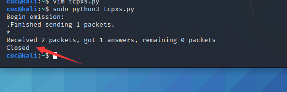 
    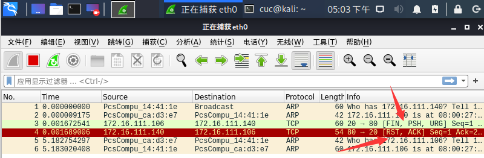 
    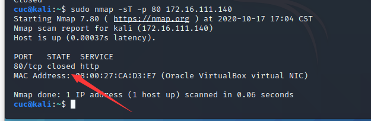 
 - 分析：Xmas发送TCP请求，在靶机端口关闭状态下，靶机响应[RST，ACK]，抓包结果与预期结果一致。

* Open  
    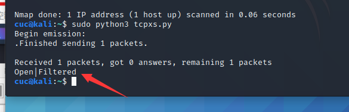 
    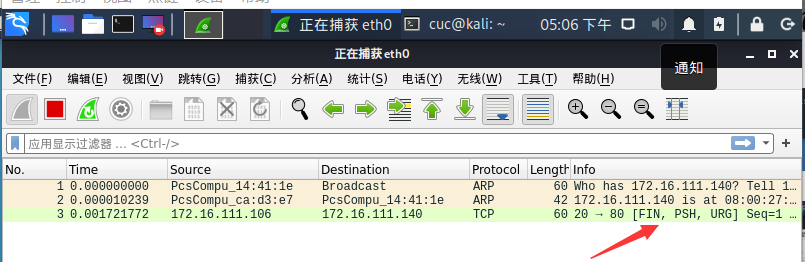 
    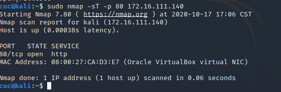 
 - 分析：Xmas发送TCP请求，在靶机端口开放状态下，靶机无响应，抓包结果与预期结果一致。  
    
* Filtered  
    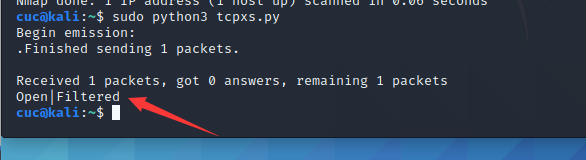
    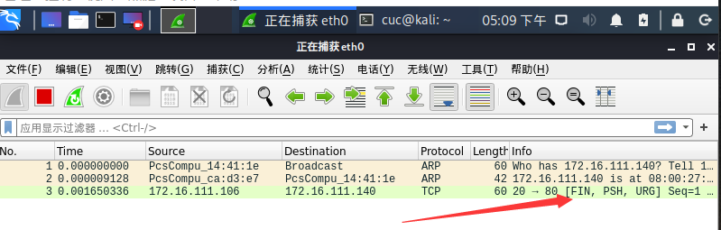
    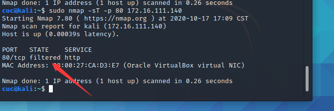
 - 分析：Xmas发送TCP请求，在靶机端口被过滤状态下，靶机无响应，抓包结果与预期结果一致。  


#### TCP FIN scan

* 实验预期获得的结果：仅发送FIN包，FIN数据包能够通过只监测SYN包的包过滤器，隐蔽性较SYN扫描更⾼，此扫描与Xmas扫描也较为相似，只是发送的包未FIN包，同理，收到RST包说明端口处于关闭状态；反之说明为开启/过滤状态。

* python
```
  #攻击者主机编写tcpfin.py
  from scapy.all import *
  def finscan(dst_ip , dst_port , timeout = 10):
      pkts = sr1(IP(dst=dst_ip)/TCP(dport=dst_port,flags="F"),timeout=10)#发送FIN包
      if (pkts is None):
          print ("Open|Filtered")
      elif(pkts.haslayer(TCP)):
          if(pkts.getlayer(TCP).flags == 0x14):
              print ("Closed")
      elif(pkts.haslayer(ICMP)):
          if(int(pkts.getlayer(ICMP).type)==3 and int(pkts.getlayer(ICMP).code) in [1,2,3,9,10,13]):
              print ("Filtered")
  finscan('172.16.111.140',80)
  ```  

* Closed  
    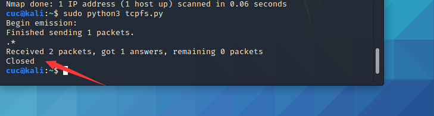 
    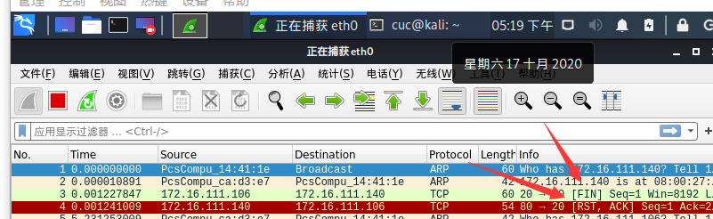 
    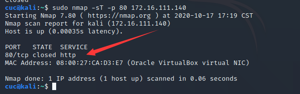 

* Open  
    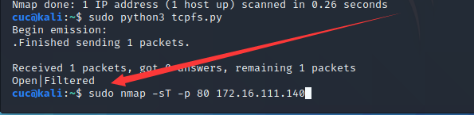 
    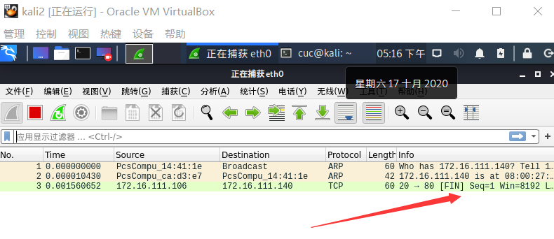 
    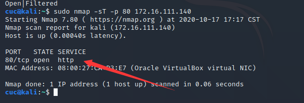 

* Filtered  
    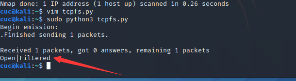
    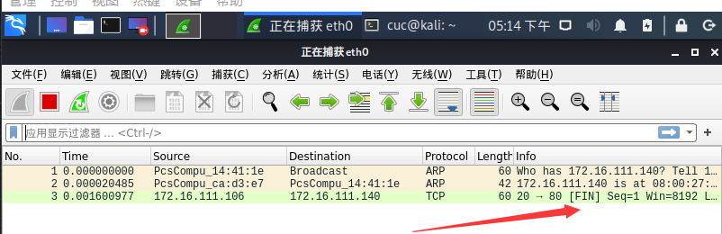
    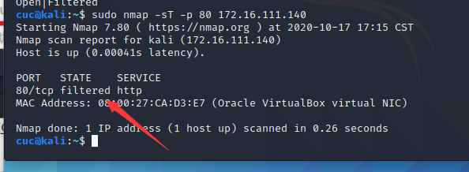


####  TCP null scan 

* 实验预期获得的结果：发送的包中关闭所有TCP报⽂头标记，实验结果预期还是同理：收到RST包说明端口为关闭状态，未收到包即为开启/过滤状态

* python
```
  from scapy.all import *
  def nullscan(dst_ip , dst_port , timeout = 10):
      pkts = sr1(IP(dst=dst_ip)/TCP(dport=dst_port,flags=""),timeout=10)
      if (pkts is None):
          print ("Open|Filtered")
      elif(pkts.haslayer(TCP)):
          if(pkts.getlayer(TCP).flags == 0x14):
              print ("Closed")
      elif(pkts.haslayer(ICMP)):
          if(int(pkts.getlayer(ICMP).type)==3 and int(pkts.getlayer(ICMP).code) in [1,2,3,9,10,13]):
              print ("Filtered")
  nullscan('172.16.111.140',80)
  ```  

* Closed  
    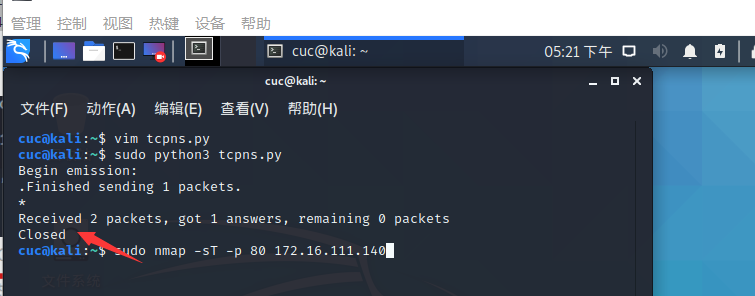 
    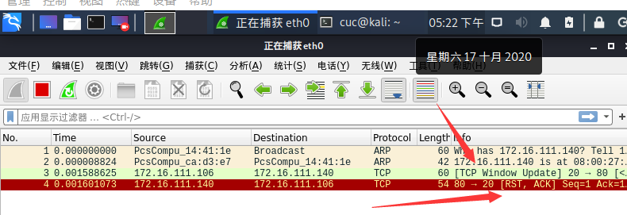 
    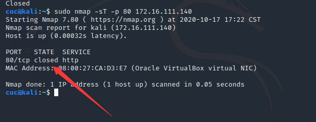 

* Open  
    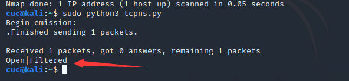 
    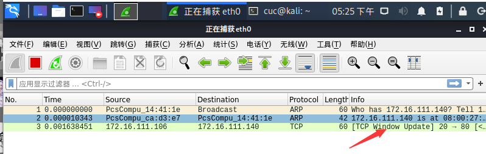 
    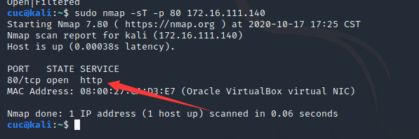 

* Filtered  
    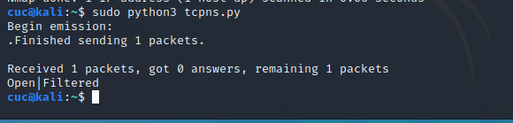
    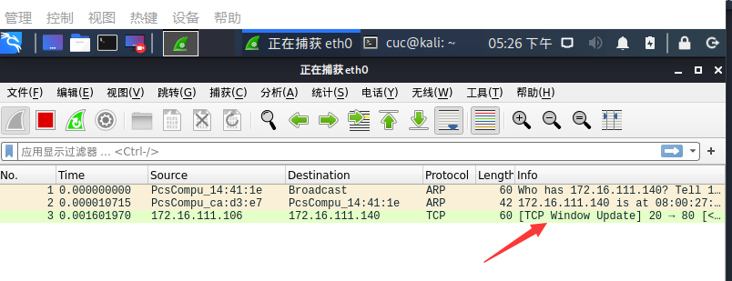
    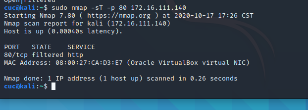


####  UDP scan 

* 实验预期获得的结果：通过发送UDP包进行扫描。当收到UDP回复时，该端口为开启状态；否则即为关闭/过滤状态

* python
```
 from scapy.all import *
  def udpscan(dst_ip,dst_port,dst_timeout = 10):
      resp = sr1(IP(dst=dst_ip)/UDP(dport=dst_port),timeout=dst_timeout)
      if (resp is None):
          print("Open|Filtered")
      elif (resp.haslayer(UDP)):
          print("Open")
      elif(resp.haslayer(ICMP)):
          if(int(resp.getlayer(ICMP).type)==3 and int(resp.getlayer(ICMP).code)==3):
              print("Closed")
          elif(int(resp.getlayer(ICMP).type)==3 and int(resp.getlayer(ICMP).code) in [1,2,9,10,13]):
              print("Filtered")
          elif(resp.haslayer(IP) and resp.getlayer(IP).proto==IP_PROTOS.udp):
              print("Open")
  udpscan('172.16.111.140',53)
  ```  

* Closed  
    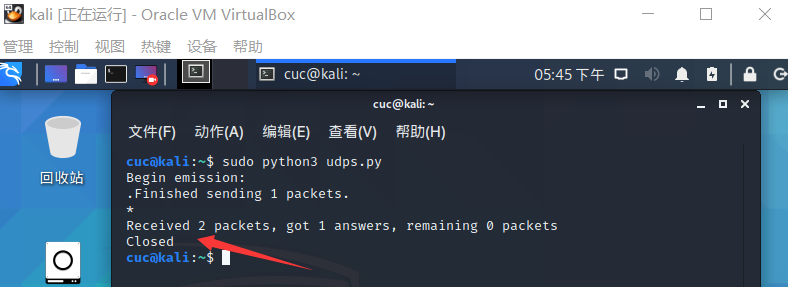 
    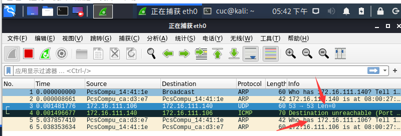 
    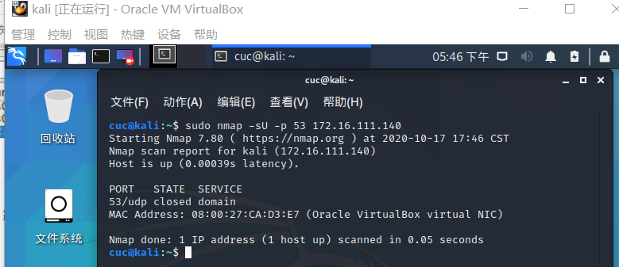 
 - 分析：UDP扫描属于开放式扫描，靶机udp/53 端口关闭状态下，对攻击者主机并无任何响应，抓包结果与预期结果一致。

* Open  
    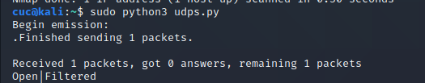 
     
     
 - 分析：UDP扫描属于开放式扫描，靶机udp/53 端口开启状态下，对攻击者主机并无任何响应，无法判断被过滤或开启，抓包结果与预期结果一致。  

* Filtered  
    
    
    
 - 分析：UDP扫描属于开放式扫描，靶机udp/53 端口被过滤状态下，对攻击者主机并无任何响应，无法判断被过滤或开启，抓包结果与预期结果一致。  


### 实验总结
* 实验结果与猜想基本相符，但是在使用编程扫描的时候比课本中实现的更详细，例如` UDP`扫描中,我们可以看到课本中提供的只是在收到UDP包的情况下可以确认端口为开放状态下，编程实现的过程中还可以通过ICMP包中是否包含UDP包进行判断端口是否为开放状态。这是由于编程实现可以更加详细的分析抓到的包。

### 问题及解决  
1.iptables无法正常运行使用
解决：使用前运行`export PATH=$PATH/sbin`
2.python代码运行失败
解决：代码前加`sudo`获得管理员权限

### 实验参考资料
[2019-NS-Public-chencwx](https://github.com/CUCCS/2019-NS-Public-chencwx/blob/ns_chap0x05/ns_chapter5/%E7%BD%91%E7%BB%9C%E6%89%AB%E6%8F%8F%E5%AE%9E%E9%AA%8C%E6%8A%A5%E5%91%8A.md) 
[课件](https://c4pr1c3.github.io/cuc-ns/chap0x05/exp.html)
[视频](https://www.bilibili.com/video/BV1Ev411y7M9)
