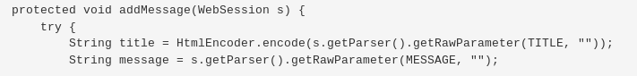

# 网络安全第七章实验报告  
## Web 应用漏洞攻防 - WebGoat  

### 实验目的  
* 了解常见 Web 漏洞训练平台  
* 了解常见 Web 漏洞的基本原理  
* 掌握 OWASP Top 10 及常见 Web 高危漏洞的漏洞检测、漏洞利用和漏洞修复方法  

### 实验环境  
* Kali  
* WebGoat 
* Burp Suite 
* Fire fox

### 实验要求  
 - [x] 每个实验环境完成不少于5种不同漏洞类型的漏洞利用练习  
 - [x] （可选）使用不同于官方教程中的漏洞利用方法完成目标漏洞利用练习  
 - [ ] （可选）最大化漏洞利用效果实验  
 - [X] （可选）编写自动化漏洞利用脚本完成指定的训练项目  
 - [x] （可选）定位缺陷代码  
 - [x] （可选）尝试从源代码层面修复漏洞  

### 实验过程
#### 实验环境准备
- 安装docker-compose  
```
sudo apt update && sudo apt install docker-compose 
```
- 查看docker镜像
```  
apt policy docker.io
```
- 新建工作目录并切换
```
mkdir workspace && cd workspace/
```
- 下载课程所需漏洞练习环境并切换到相应目录下
```
git clone https://github.com/c4pr1c3/ctf-games.git --recursive 
&& cd ctf-games/
```
- 配置环境
```
cd owasp/webgoat/ && sudo docker-compose up -d  
```  

 

- 检测容器当前状态 
``` 
docker ps  
```  

 

- 登录Webgoat页面`127.0.0.1:8087/WebGoat/attack`验证安装成功，且端口开放正确

 

 

#### WebGoat 
### 1. Forgot Password 
- Web应用为用户提供取回密码的功能，但是许多应用的实现策略实现的很差，导致用于验证用户的信息非常简单

- 测试管理员`admin`，经过测试得到管理员最喜欢的颜色是`green`

  

### 2. Stored XSS Attacks 
- 在`Title`中输入任意值(e.g. `hack`)，`Message`输入`<script>alert(document.URL);</script>`

- 点击`Message List`中的超链接：

   
- 可以看到 ，本应该在`Message Contents`中显示的文本`<script>alert(document.URL);</script>`，却被当作Java代码被执行了

- 查看源码漏洞，由于对用户输入的`Messgae`信息中的未进行过滤，导致恶意代码得以被存储与执行。

  

-  `HtemlEncoder.enocode()`对特殊字符进行转义

- 观察到源码中`title`变量被转义过滤，因此，改为在`Title`中输入`<script>alert(document.URL);</script>`：

   
  
-  `Message Contents`正常显示了输入内容，并无任何弹窗 **solved**

    
  
### 3. Command  Injection
- 观察发现该网页的信息由命令行执行输出

    

- 在开发者工具中找到下拉菜单框的html源码

  - 在之后添加攻击命令`"&& cat "/etc/passwd`

   

  - 点击`View`

   

  
- 拦截请求后，在`Params`中修改`HelpFile`参数：添加上`"&&echo "hacked`
  
   
  
- 点击`Forward`发送请求
  
   

- 查看漏洞，发现没有对参数进行校验，同时又**预设**了输入参数的个数

    

- 执行前对参数进行校验，检查符号`&`的个数**solved**

  ```javascript
  var offset = 0
  var subStr = command[2]
  do { offset = subStr.indexOf("&", offset);
    if(offset != -1)
     { count++; offset += subStr.length;
      } }while(offset != -1);
  ```

### 4.Malicious File Execution

- 选择`Browser`选定一张图片，`Start Upload`上传

  - 如果`kali`本地恰好没有图片，可以利用`Firefox`截图功能：`Developer Toolbar`>`screenshot xx.png`

  - 直接`touch`一个也是可以的

      

  - `View Image Info`，记录文件运行URL为`localhost:8087/WebGoat/Uploads/homepage.png`，因此之后需要将`homepage.png`该文恶意执行的`jsp`文件，以次执行恶意代码

- 新建`hack.jsp`

  ```jsp
  <HTML>
  
  <% java.io.File file= newjava.io.File("/.extract/webapps/WebGoat/mfe_target/webgoat.txt");file.createNewFile();%>
  
  </HTML>
  ```

- 上传

    

- `copy Image Location`，新建一个`Tab`，输入复制的URL，此时恶意代码得到执行（指定目录下新建一个txt文件）

- 返回原界面，刷新，**solved**

    

- 查看漏洞，上传文件直接写入本地，而不对文件类型加以检查

    

- 检测上传文件后缀名

  ```java
  String suffix = fileName.substring(fileName.lastIndexOf('.'));
  if(suffix == "png" || suffix == "jpg" || suffix == "bmp"){
      Item.write(uploaded_file_path);
  }
  ```

### 5.Bypass HTML Field Restrictions

- 攻击方法一：开发者工具`DevTools`

  - 在`input checkbox`中加入`value`属性

  - 在`input disable`中删除`disable=""`

  - 修改数值

      

  - 提交

- 攻击方法二：`Burpsuite`

  - 修改源码，在`input disable`中删除`disable=""`

  - 拦截请求，修改参数

      

  - 点击`Forward`，`Intercept off`关闭拦截，**solved**

      


### 问题及解决 
- 1. 搭建环境安装docker-compose时出现`Couldn't connect to Docker daemon at http+docker://localhost - is it running?`的报错
  * 解决办法：启动docker` systemctl start docker`即解决

- 2.webgoat网页加载出错，浏览器显示代理设置有问题，但fox浏览器的127.0.0.1:8080为开启状态。
  * 解决方法：在Burp Suite -- Proxy -- Intercept中开启intercept is off选项即解决
 


### 参考资料
[网络安全教材第七章](https://c4pr1c3.github.io/cuc-ns/chap0x07/main.html)  
[WebGoat错误处理](https://blog.csdn.net/lay_loge/article/details/89531924)
[前人实验报告](https://github.com/CUCCS/2019-NS-Public-chencwx/tree/ns_chap0x07/ns_chapter7)