# 应用程序安全加固

### 实验目的

- 从web和ssh方面进行应用程序安全加固的体验

### 实验环境

- Kali2
- kali3


### 实验过程

#### 环境准备
- 准备两台可以互相连通的kali主机kali2，kali3

 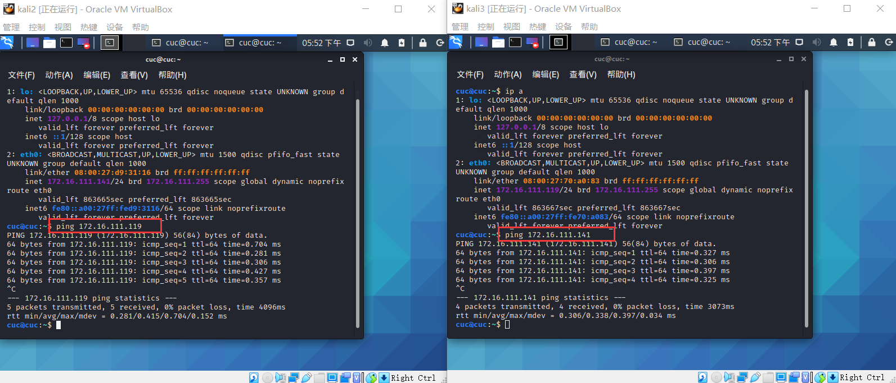

#### Apache内置安全设施

- 查看可用的模块并搜索需要的security模块

    ```bash
    ls -l /etc/apache2/mods-enabled/

    - 搜索security软件包
    apt search apache | grep security
    ```

    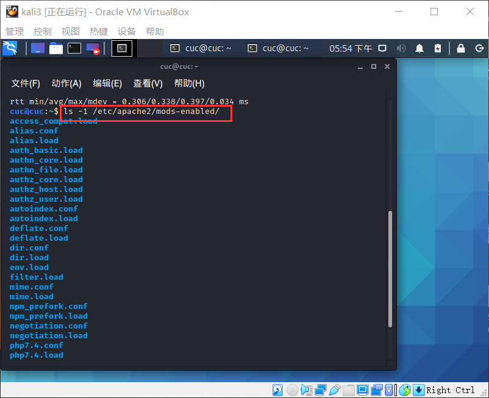

    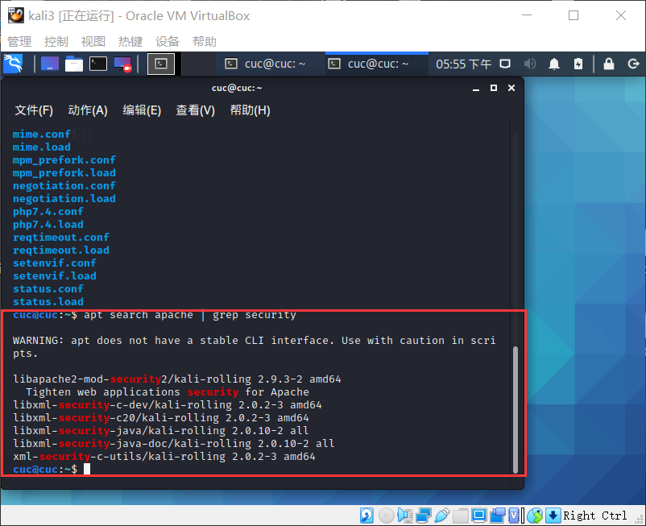

- 安装相关模块

    ```bash
    apt update && apt-get install libapache2-mod-security2
    ```

    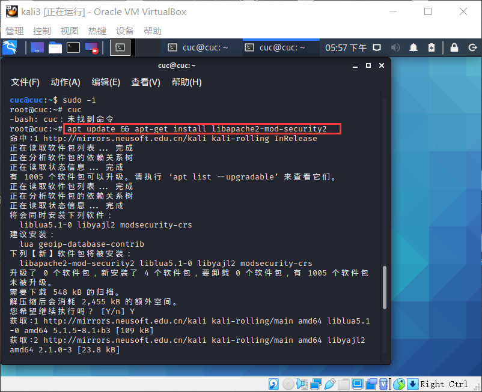

- 查看刚刚下载的与security相关的包

    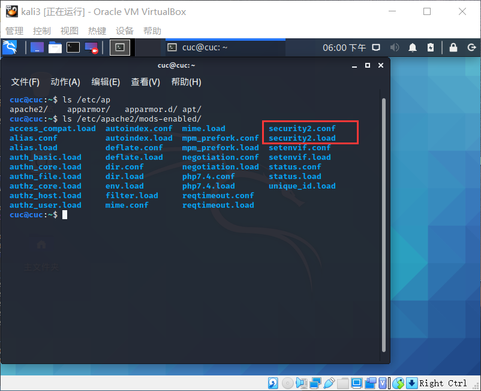

- 配置规则

    ```bash
    - 备份规则
    mv /usr/share/modsecurity-crs /usr/share/modsecurity-crs.bk

    - 下载 OWASP ModSecurity Core Rule Set
    git clone https://github.com/SpiderLabs/owasp-modsecurity-crs.git /usr/share/modsecurity-crs

    - 启用配置文件
    cd owasp-modsecurity-crs
    mv crs-setup.conf.example crs-setup.conf

    - 修改配置
    gedit /etc/apache2/mods-enabled/security2.conf

     - 在文件中添加规则路径
    <IfModule security2_module> 
        SecDataDir /var/cache/modsecurity 
        IncludeOptional /etc/modsecurity/*.conf 
        IncludeOptional /usr/share/modsecurity-crs/*.conf 
        IncludeOptional /usr/share/modsecurity-crs/rules/*.conf 
    </IfModule>

    - 启用引擎
    gedit /etc/modsecurity/modsecurity.conf

    - 将 DectionOnly 改为 On
    SecRuleEngine On

    - 重启以生效
    systemctl restart apache2
    ```

    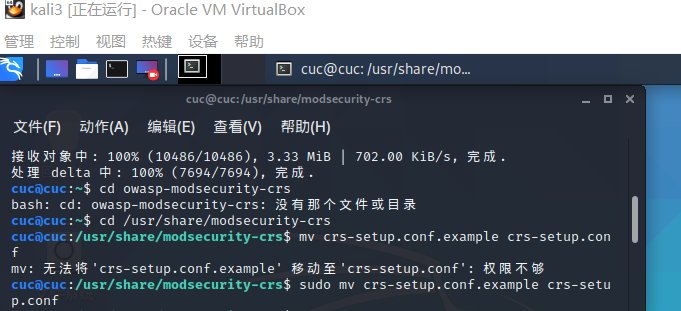
    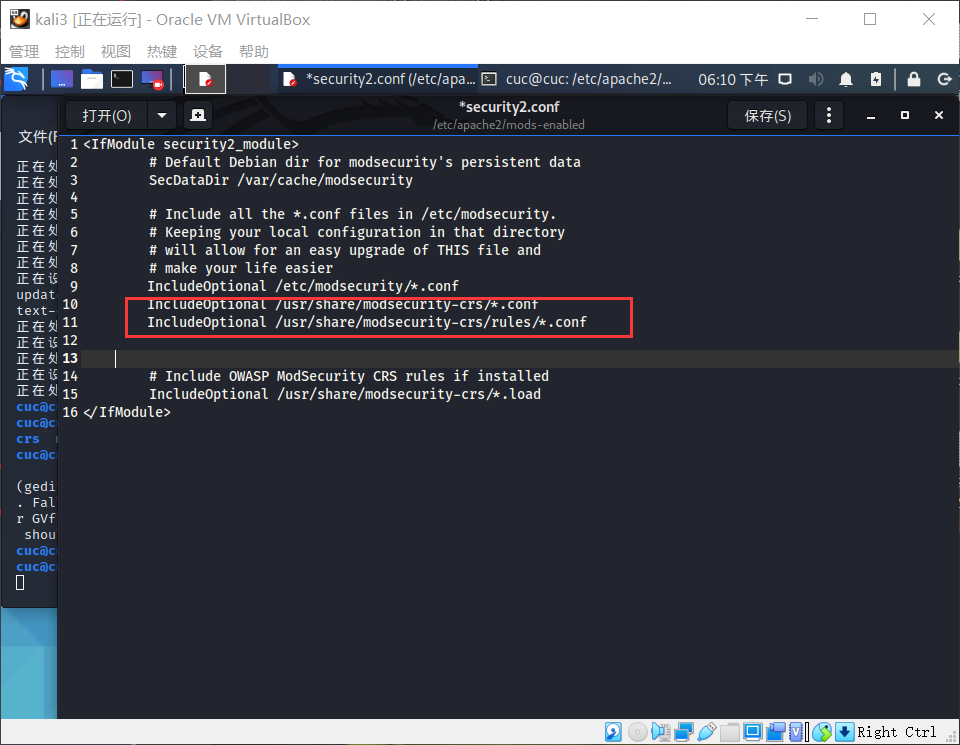

- 将配置生效`systemctl restart apache2`
    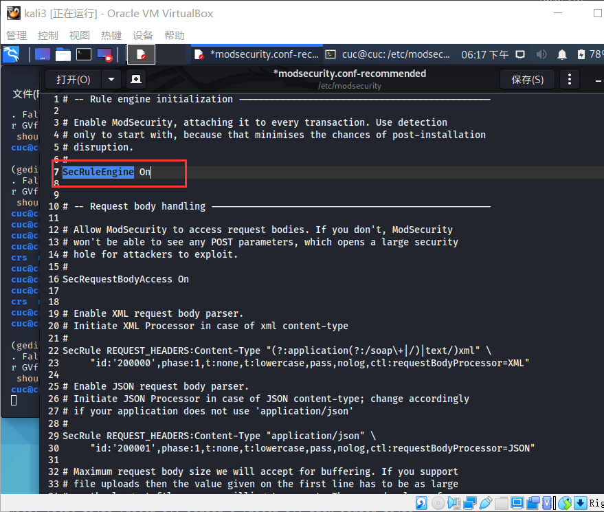
    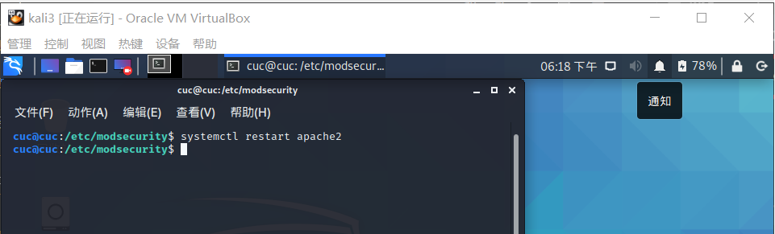

- 让攻击者主机对靶机进行简单的xss攻击（使用curl命令），发现被拒绝

    ```bash
    curl 'http://172.16.111.119/?q="><script>alert(./1)</script>'
    ```

    

- 查看日志文件，会发现该行为被记录了下来

    ```bash
    tail error.log
    ```

    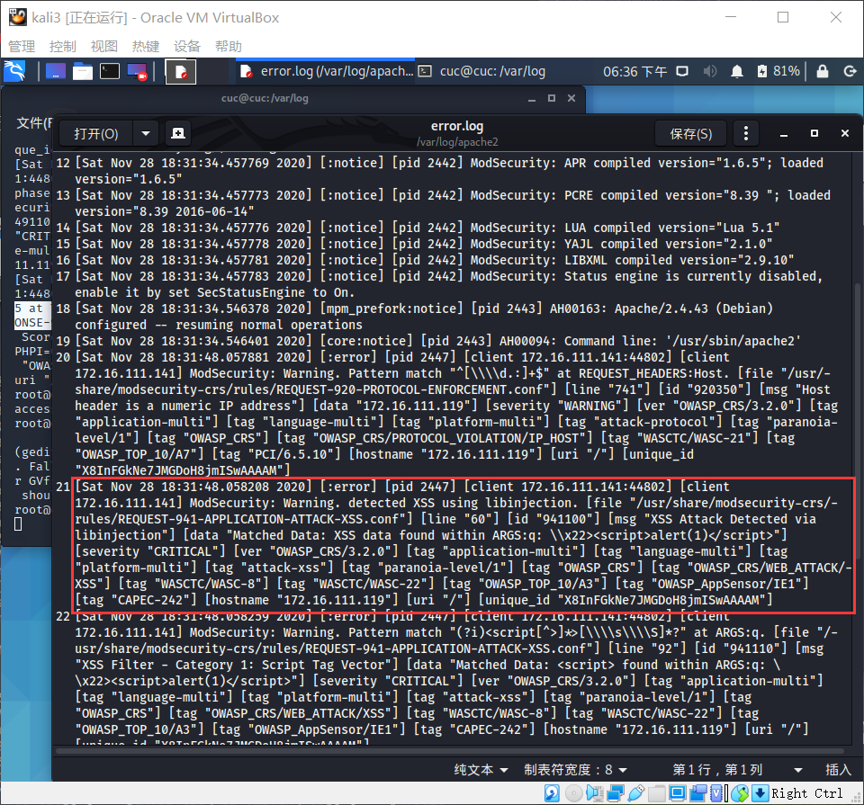


- 说明规则设置生效，可预防owasp中的一些攻击并且能通过日志记录下来，web应用安全得到了加固


#### fail2ban

### ssh
- 尝试进行ssh链接失败

 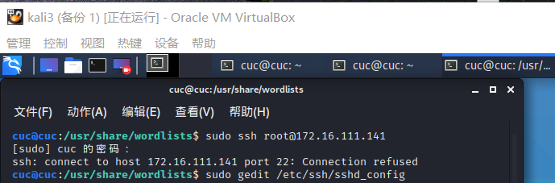


- 修改Victim的ssh配置

    ```bash
    - 启动服务
    systemctl start ssh

    - 修改配置文件，允许Root用户使用ssh登录
    gedit /etc/ssh/sshd_config
    
    - 在Authentication部分添加
    PermitRootLogin	yes 

    - 重启ssh服务
    systemctl restart ssh
    ```

    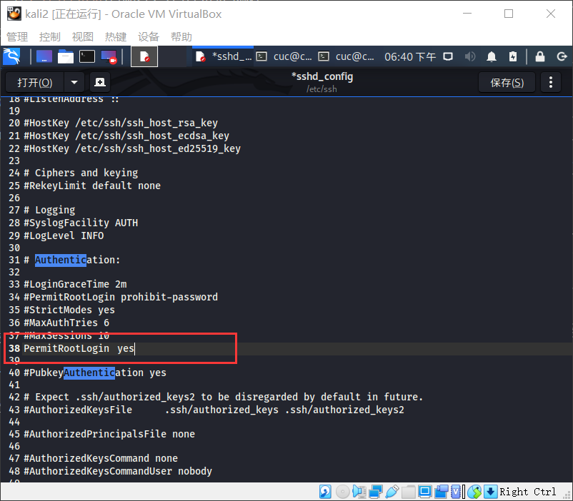

- 攻击者修改配置后能够正常ssh连接

    

### 爆破ssh

- 解压爆破字典，使用字典进行爆破

    ```bash
    - 解压爆破字典
    gzip -d /usr/share/wordlists/rockyou.txt.gz

    - 类似的爆破工具还有：medusa/ncrack
    hydra -l root -P /usr/share/wordlists/rockyou.txt -v 172.16.111.141 ssh
    ```
- 弱指令爆破成功
     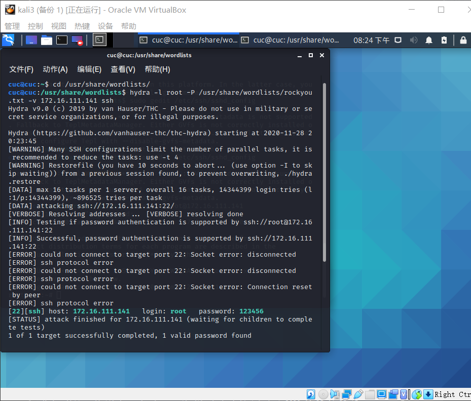


**fail2ban**

- 安装并启动后，并没有开启任何一个jail，需要手动设置开启

    ```bash
    - 安装
    git clone https://github.com/fail2ban/fail2ban.git
    cd fail2ban
    sudo python setup.py install

    - 查看是否安装成功
    fail2ban-client -h

    - 启动 fail2ban
    fail2ban-client start

    - 预置的jail
    ls /etc/fail2ban/filter.d/
    ```

    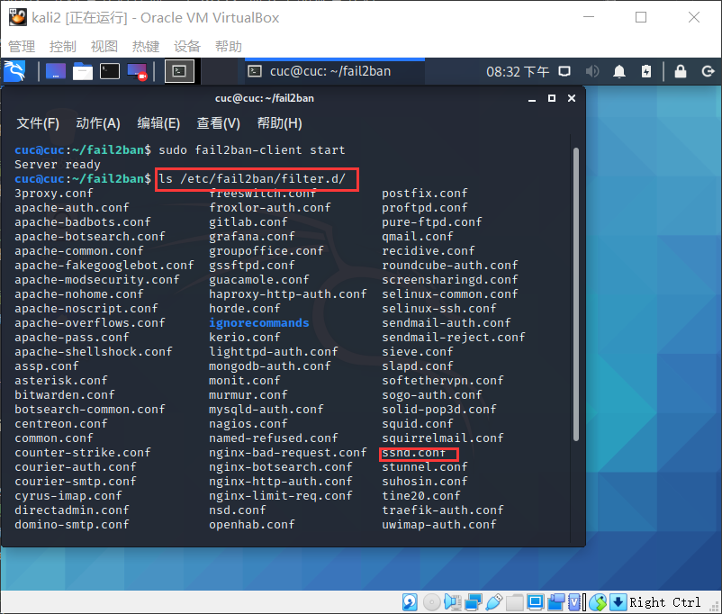

- 可对 jail.conf fail2ban.conf 等配置文件中的配置项进行自定义配置（需要注意格式）

    ```bash
    - 拷贝配置文件并重命名为 `jail.local`
    cp /etc/fail2ban/fail2ban.conf /etc/fail2ban/jail.local
    gedit /etc/fail2ban/jail.local

    - 添加以下内容开启sshd jail
    [sshd]
    enabled = true

    - 查看相关的配置信息
    - 默认禁止时间为 10 min ，可在 `jail.local` 文件中自定义（而无需修改当前默认的配置文件）
    gedit /etc/fail2ban/jail.local
    ```

    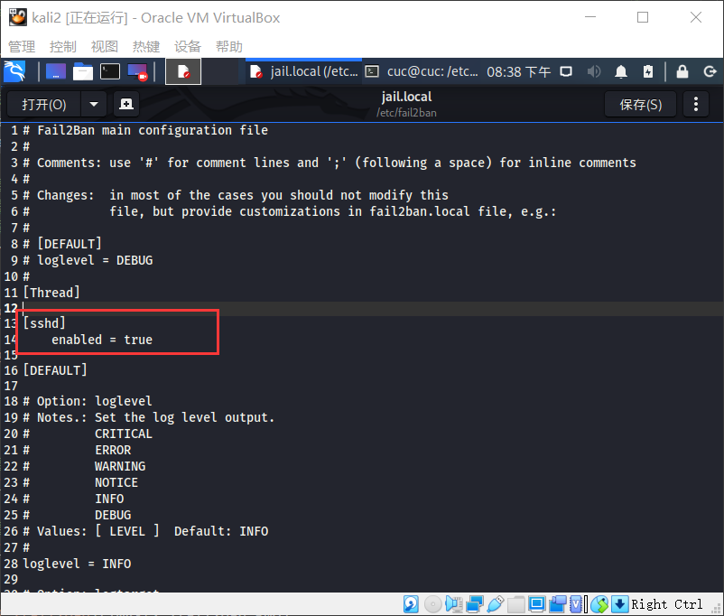

    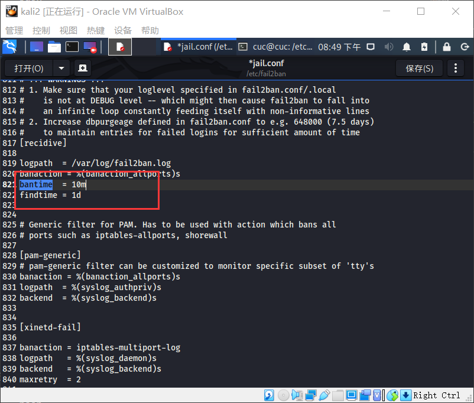

- 启用sshd jail后重启服务，暂时没有发现被禁止的ip

    ```bash
    - 重启服务
    fail2ban-client restart 

    - 查看jail信息
    fail2ban-client status

    - 查看 sshd jail 信息
    fail2ban-client status sshd
    ```

    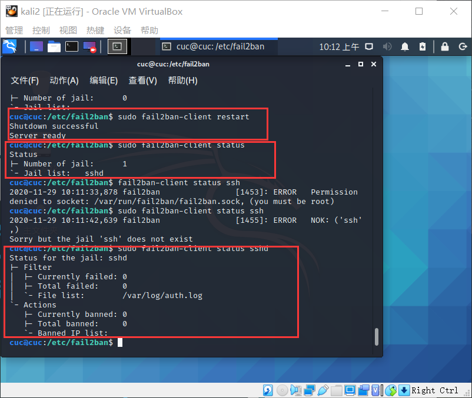

- 多次调试后发现了被禁止的攻击者ip

    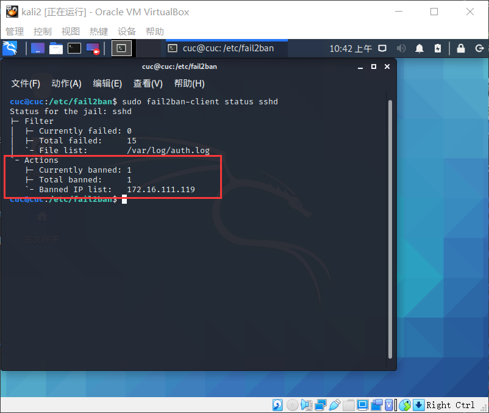

- 在防火墙中我们也可以看到被禁止的ip，说明该禁止的原理就是通过设置防火墙规则进行拒绝

    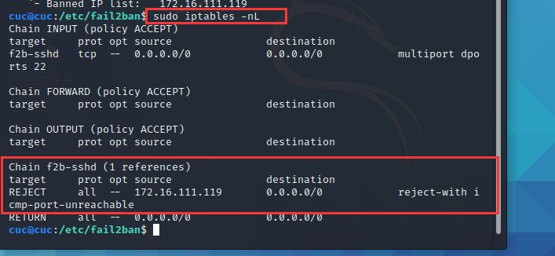


-   查看日志
    ```bash
    - 查看日志,查找相关信息
    gedit /var/log/fail2ban.log
    ```

    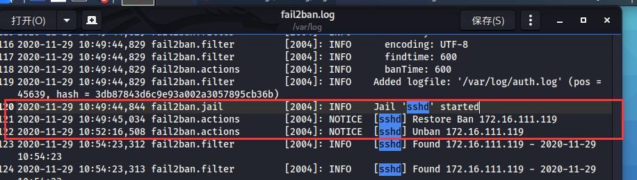

- 恢复实验环境

    ```bash
    - 清空jail，无需重启fail2ban服务
    fail2ban-client unban all
    ```

    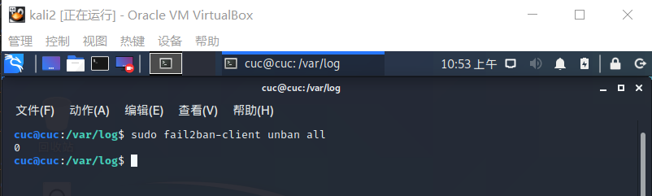

#### 参考资料  
- [2018-NS-Public-jckling/ns-0x10/chap0x10实验.md](./https://github.com/CUCCS/2018-NS-Public-jckling/blob/ns-0x10/ns-0x10/chap0x10%E5%AE%9E%E9%AA%8C.md)

- [2019-NS-Public-chencwx/ns_chapter10/README.md](./https://github.com/CUCCS/2019-NS-Public-chencwx/blob/ns_chap0x10/ns_chapter10/README.md)
 
- [第十章 应用程序安全加固](./https://c4pr1c3.github.io/cuc-ns/chap0x10/main.html)

- [课程视频](./https://www.bilibili.com/video/BV1Wz4y1k7eM)