# 常见蜜罐体验和探索

### 实验目的

- 了解蜜罐的分类和基本原理
- 了解不同类型蜜罐的适用场合
- 掌握常见蜜罐的搭建和使用

### 实验环境

- kali：kali3(Attacker)：172.16.111.119
- kali: 11v(Victim)：172.16.111.120

### 实验要求

- [x] 记录蜜罐的详细搭建过程；
- [x] 使用 `nmap` 扫描搭建好的蜜罐并分析扫描结果，同时分析「 `nmap` 扫描期间」蜜罐上记录得到的信息；
- [x] 如何辨别当前目标是一个「蜜罐」？以自己搭建的蜜罐为例进行说明；
- [x] （可选）总结常见的蜜罐识别和检测方法；
- [ ] （可选）尝试基于 [canarytokens]搭建蜜信实验环境进行自由探索型实验；

### 实验过程
- 测试实验主机互相连通性

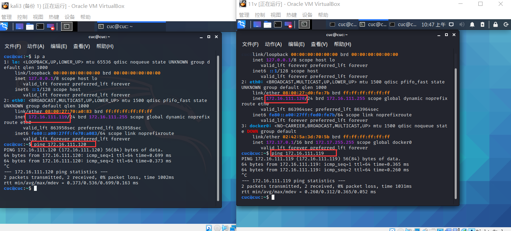 

#### 低交互蜜罐——ssh-Honeypot

- 选择理由：该蜜罐为一种极低交互式的简单蜜罐，配置docker容器即可观察。

- 添加docker-ce的apt 源

  ```bash
  apt-get update
  apt-get install -y apt-transport-https ca-certificates curl software-properties-common
  ```

  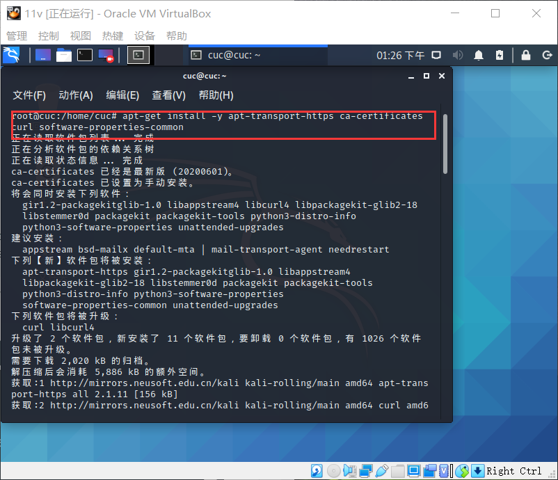


- 添加docker需要的密钥

  ```bash
  curl -fsSL https://download.daocloud.io/docker/linux/ubuntu/gpg | sudo apt-key add -

  curl -fsSL https://download.docker.com/linux/debian/gpg | sudo apt-key add -
  
  ```

  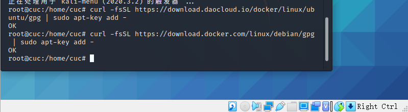

- 进行docker-ce的安装

  ```bash
  sudo apt-get update
  sudo apt-get install docker-ce
  ```
  
  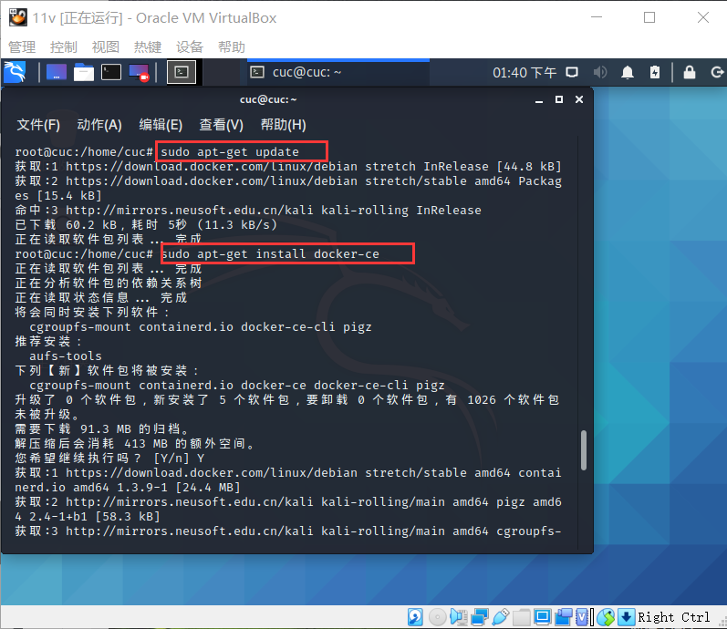

  
- 开启docker服务并测试是否安装成功

  ```bash
  systemctl start docker
  sudo docker run helloword
  ```

  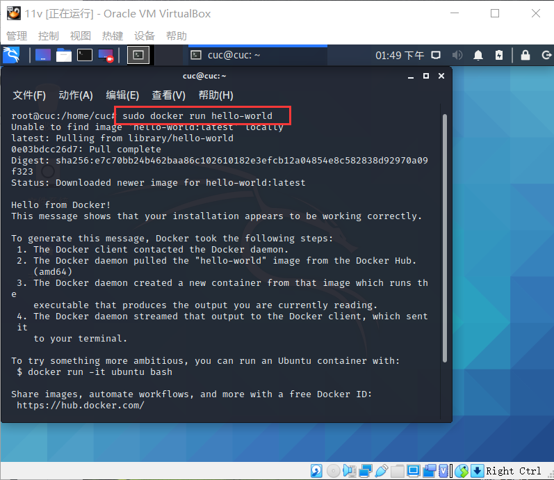

- 使用`docker imgs`指令查看镜像

  

- 安装ssh-honeypot，首先确保libssh&libjson-c已经安装

  ```bash
  apt install libssh-dev libjson-c-dev
  ```

  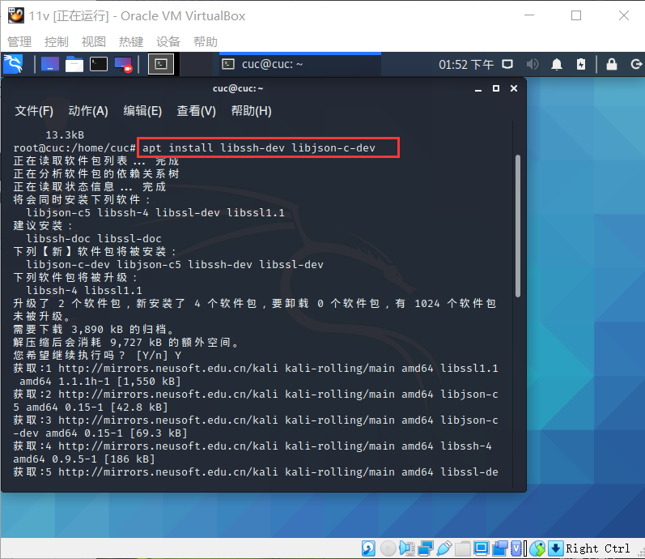

- 安装ssh，暂时先不设置密码

  ```bash
  $ ssh-keygen -t rsa -f ./ssh-honeypot.rsa
  ```
  
  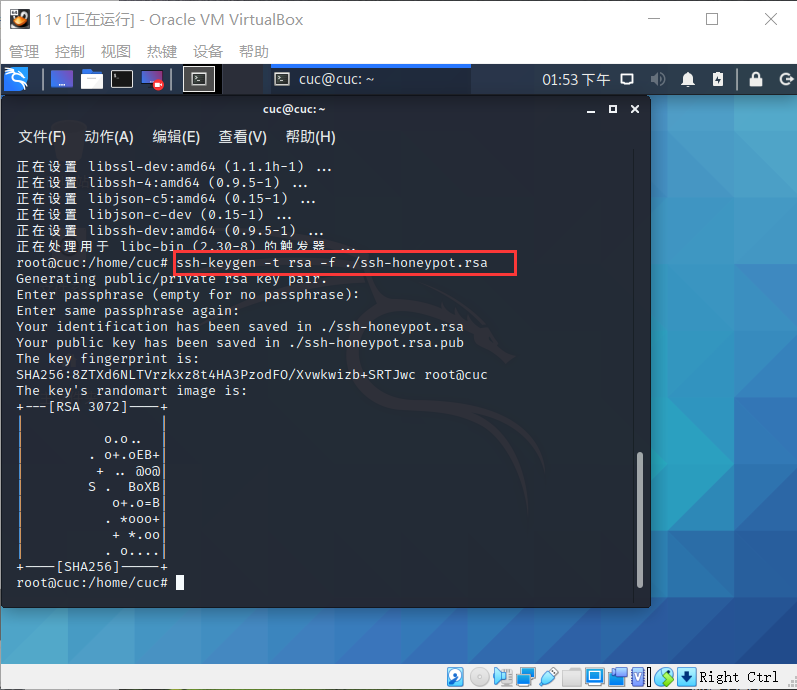
  
- 接下来安装`docker-ssh-honeypot`

  ```bash
  git clone https://github.com/random-robbie/docker-ssh-honey
  docker build . -t local:ssh-honeypot#构建镜像
  docker run -p 2234:22 local:ssh-honeypot# 运行镜像 格式为本地端口:容器端口 
  docker exec -i -t id bash 
  tail -F ssh-honeypot.log#查看日志
  ```

  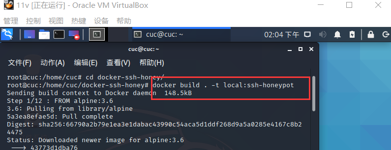

  
  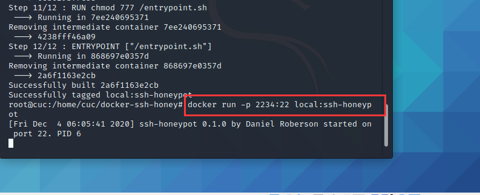

  
- 通过`docker ps`查看容器的id,这样才能进入容器

  ```bash
  docker ps
  docker exec -i -t container_id bash 
  ```

  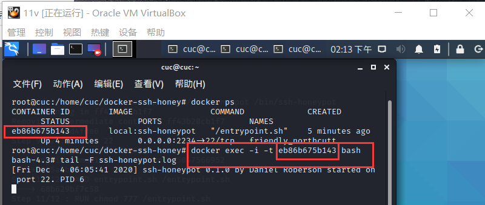


- ```bash
  tail -F ssh-honeypot.log#查看日志
  ```

- `attacker`对蜜罐所在主机端口进行ssh连接，进行观察，发现安装蜜罐的主机日志已经把该行为记录下来了

  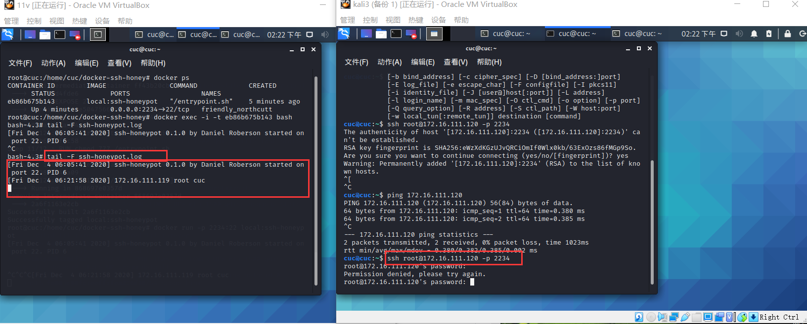

- 再次多次连接，发现无论输什么密码，连接都会被拒绝，而且查看日志信息发现输入密码，攻击者ip等都被记录下来了，起到了采集攻击者信息的作用达到了蜜罐的初步目标。

  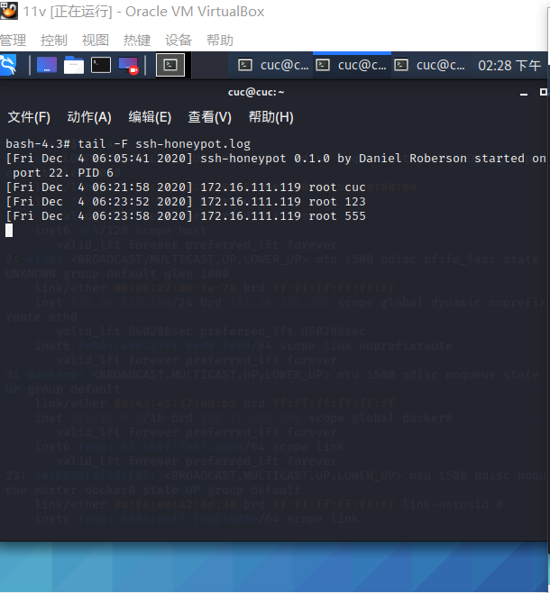

- 原因是ssh-honeypot是一个低交互式的蜜罐，无法完成这些功能，但是日志能记录下所有攻击者的行为


- 进行诸如TCP connect scan，TCP ping等多种扫描，我们发现日志信息中并没有记录下，说明该蜜罐并未对此生效，也再一次说明了该蜜罐的低交互式，只是一个可以简单记录ssh连接的简易蜜罐

    ```
    #TCP connect scan
    nmap -sT -P 2234 -n -vv 172.16.111.120
    #TCP ping扫描
    nmap -sP -P 2234 -n -vv 172.16.111.120
    ```
    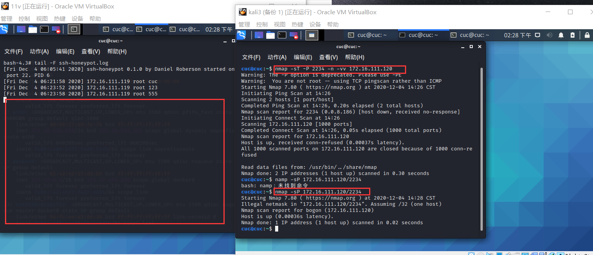


#### 中交互蜜罐——Cowrie

- 选择原因：Cowrie是一种中到高交互性的SSH和Telnet蜜罐，旨在记录暴力攻击和攻击者执行的shell交互。且在GitHub保持更新

 - [在docker中安装Cowrie](https://hub.docker.com/r/cowrie/cowrie)

    ```bash
    docker pull cowrie/cowrie
    ```

  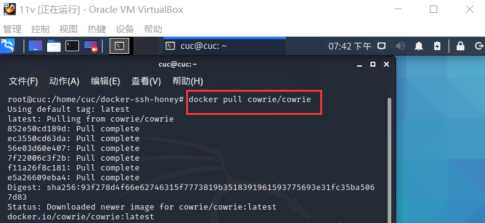

- 启动cowrie，在端口2222开启，同时在`kali3`中进行ssh连接攻击者，先使用正确的密码登录，发现日志信息已经记录下了所有行为
  
  ```bash
  docker run -p 2222:2222 cowrie/cowrie
  ```
  
  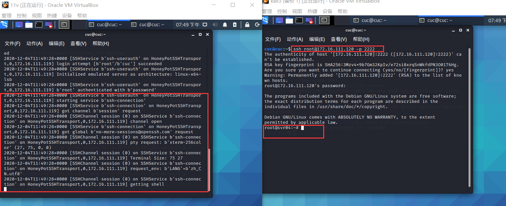

  
- 使用任意用户，发现在输入多次密码后被拒绝连接，原因该蜜罐设置了不允许非root用户连接
  
  
  
- 对于root用户，使用任意密码登录，输任意密码都可以登录。
  
  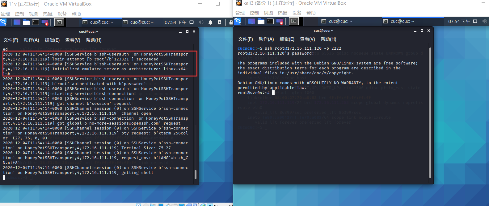

- 原因是蜜罐的安全性必须保证，否则攻击者输入的是一段恶意代码，很有可能最后蜜罐反被当成“肉机”，这也是蜜罐的一个特点。
  
- ssh链接还存在自动关闭现象
  
  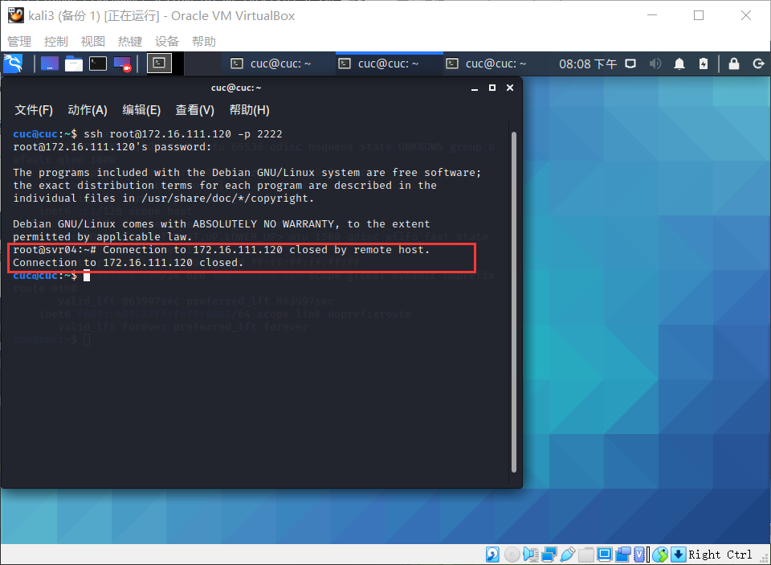
  
- 进入日志查看消息可以看到进行攻击的信息
  
  ```bash
  docker exec -i -t container_id bash 
  cat cowrie.json 
  ```
  
  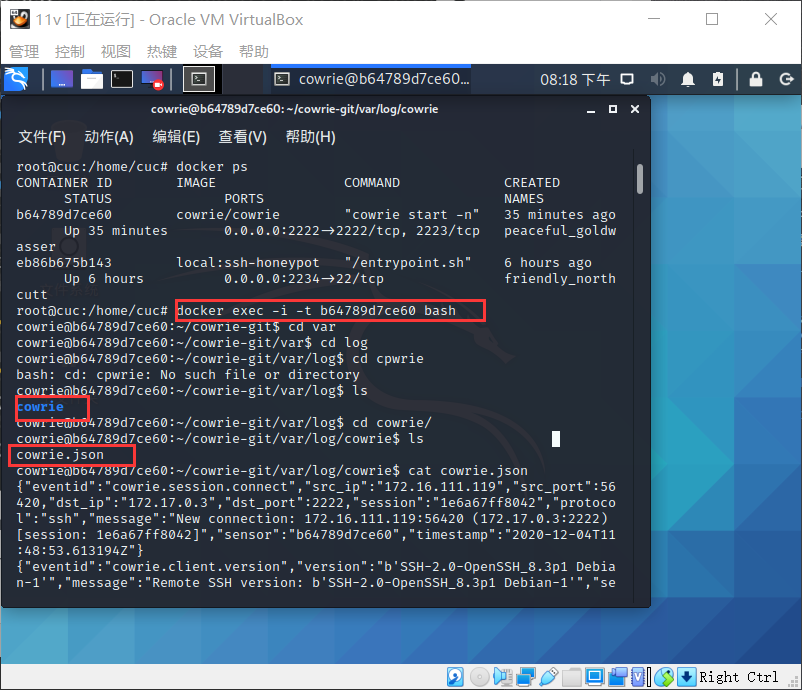
  
  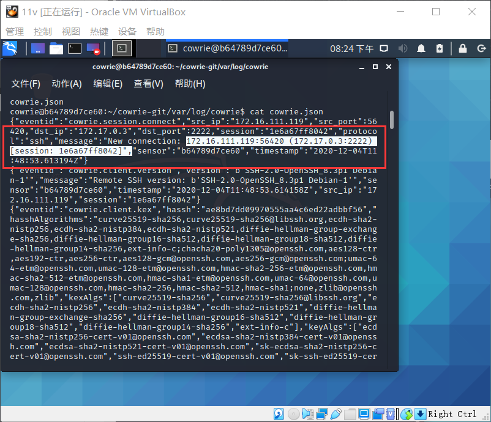

  
- 在端口2223开启cowrie蜜罐 同时进行ping与curl操作 发现可以正常运行
  
  ```bash
  ping www.baidu.com 
  curl http://www.baidu.com/helloworld
  ```
  
  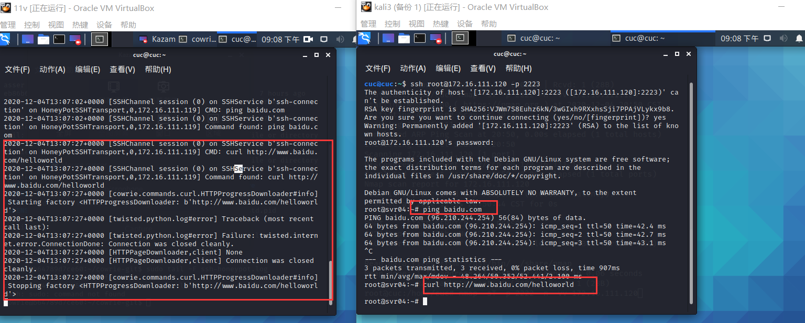
  

 进行诸如`TCP connect scan，TCP ping`等多种扫描，仅  `TCP connect scan`在靶机蜜罐中获得记录.说明该蜜罐还不够完美，但已经能够模拟进行大部分主机行为

   ```
    #TCP connect scan
    nmap -sT -P 2234 -n -vv 172.16.111.120
    #TCP ping扫描
    nmap -sP -P 2234 -n -vv 172.16.111.120
    #TCP FIN scans
    nmap -sF -P 2234 -n -vv 172.16.111.120
    #TCP Xmas scans
    nmap -sX -P 2234 -n -vv 172.16.111.120
   ```

   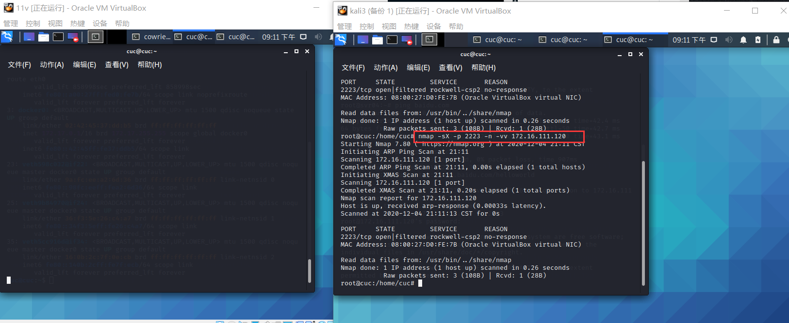

   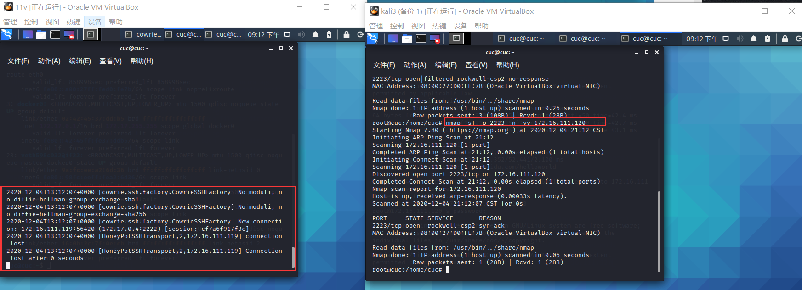

   
### 总结常见的蜜罐识别和检测方法

  - 从实验中，可以总结以下经验
    - 在安装包的时候我们也发现了蜜罐与普通真机的不同
    - 在进行ssh连接时，发现任意密码都能登录
    - 在目录中看不到应有的配置文件的存在


  - 对于真实情况下的低交互蜜罐我们的识别方法：
    - 数据包时间戳分析 
    如果我们仅通过查看网络数据包能很容易的推断出一个机器的物理属性，我们就很有可能辨别物理服务器和虚拟蜜罐。事实证明，TCP提供了一些直接反映底层服务器状态的信息。TCP时间戳选项被网络堆栈用于确定重传超时时间。机器中的无历史中安特定频率更新时间戳，我们也知道，所有的物理时钟都有一定时钟偏差，他们或多或少于实际运行时间。通过打开一个到主机的TCP链接，并记录为每个连接所提供的时间戳，就可以去观察时间偏差。我们的希望是每个物理系统或者是操作系统显示出来不同的偏差。如果说一个服务器上运行了多个蜜罐的话，就容易出现每一个蜜罐出现相同的时间偏差，这样的话蜜罐就完全暴露了。这种基于对硬件检测的思想也可以在一定程度上去实现检测是不是蜜罐。
    - 分析低交互蜜罐产生的网络响应来寻找差异 
    举个例子，LaBrea试图推迟入站TCP连接，这样做是合法的，但很少用于TCP技术。任何使用Wireshark或者是tcpdump查看连接的人都可以立刻说出正在发生什么事情。如果说蜜罐系统试图欺骗敌手，使他们相信是在和一个真的环境打交道的话，蜜罐系统在网络行为中的任何差异都可以用来检测它。

  - 对于真实情况下的高交互蜜罐我们的识别方法：
  - 检测蜜墙
    如果入侵者利用蜜网作为跳板攻击第三方系统，大多数蜜网的管理员理当害怕承担责任。因此，他们使用两种常用的技术来最小化成功攻击第三方系统的的风险：首先极其严格的限制出战连接数，每天只允许15个出站TCP链接。不幸的是，这种控制出站流量的极端措施很容易检测蜜罐的存在。对于这种特殊的限制策略，我们只需要初始化大量出站链接（到其他主机的SYN包），看一下什么时候这些连接被蜜墙阻止。最好的兼职策略就是不限制链接数量而是限制达到不同目标主机的上限，然而出站连接到大量不同主机的策略也容易被检测出来。这样的一个实验结果可能并不总是很清晰，因为现在的一些ISP也是事了一些机制，采用类似的限制连接数的方法来遏制蠕虫的传播。部署Snort_inline是一种防止出站攻击攻击造成破坏的方式，snort_inline检查出站流量中已知的漏洞利用代码，并以某种方式破坏他们，使他们停止工作。蜜网管理员一般会使用一个类似肺功能字符串类似于/bln/sh来替换shellcode里面的/bin/sh，比如说下面的代码：
     ```bash
      alert ip $HONEYPOT any->$EXTERNAL_NET any
      (    msg: “SHELLCODE x86 stealth NOOP”;  
      sid:651;    
      content:”EB 02 EB 02 EB 02”;    
      replace:”24 00 99 DE 6C 3E”;
      )
    ```
     入侵者通过构造一个包含匹配Snort_inline重写数据库规则字符串的通信流，并检查接收到的所有数据包是否有改变，可以检测蜜墙的存在。

### 参考资料
[ssh-honeypot](https://github.com/droberson/ssh-honeypot)

[cowrie](https://github.com/cowrie/cowrie)

[cowrie read](https://cowrie.readthedocs.io/en/latest/index.html) 

[Judge whether to enter the honeypot](https://www.zhihu.com/question/31213254/answer/137153019)

[git的实验报告](https://github.com/CUCCS/2019-NS-Public-chencwx/tree/ns_chap0x11/ns_chapter11)  

